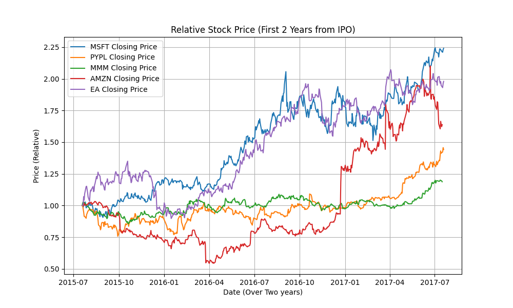

# IPO Analysis

Catching stocks from when they IPO and normalizing to see the relative performance

## Analysis

### Hypothesis

Line go up, always, since markets generally move up and unlisted companies are not considered
in the dataset, there is a bias towards the upside. Therefore this analysis is flawed without more data. 
However, given line go up theory, it always goes up, ignore the fact that 90% of new business fail,
scale is a moat of its own. 

### Results

